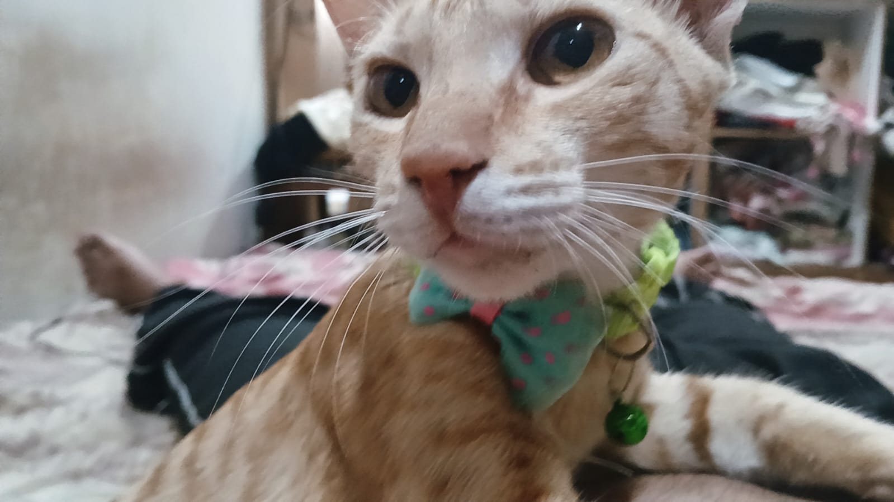

  <h1>Hey! I'm Shourya Patil 👋</h1>
  <h3>Aspiring Full-Stack Developer | Building Clean Web Apps</h3>

 

I’m passionate about building clean, functional, and user-friendly web applications. 
I enjoy turning ideas into real projects using modern web technologies, AI tools, and smooth UI/UX.

---

### 🚀 About Me

- 🔭 I’m currently working on Web Development Projects
- 🌱 I’m currently learning React, JavaScript, AI Tools & Full Stack Development
- 🎓I'm currently pursuing my B.Tech Degree in Data Science
- ⚡ Fun fact: *Iam BATMAN*

---

  <h3>🌐 Connect with me</h3>
  
  

 

  <h3>💻 Tech Stack</h3>
  
  
  
  
  
  
  
    
  
  
  

---

  <h3>📊 GitHub Stats</h3>
  
    
  
    
  

---

### 🚀 Featured Projects

#### 🎬 Movie Recommendation Website
> A clean movie recommendation platform with categories, movie posters, and trailer redirects.

#### ✍️ AirLink / Air Draw
> A gesture-based drawing website using camera and hand tracking for air drawing.

#### 💪 Fitness Website
> A modern black and neon themed fitness web app with interactive UI.

---

 

  <h2>Thanks for visiting my profile ⭐</h2>

